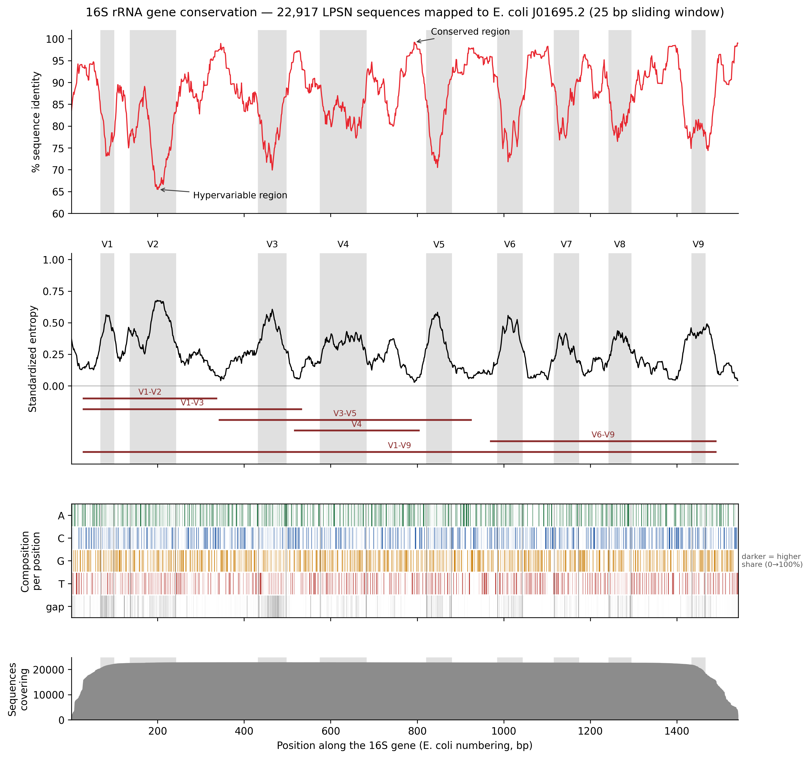

# 16S rRNA gene conservation

Per-position conservation of the bacterial and archaeal 16S rRNA gene, measured
across **22,917 type-strain sequences** from [LPSN](https://lpsn.dsmz.de/) and
projected onto the classical *Escherichia coli* coordinate frame (1–1542 bp).



---

## 1. Introduction

The 16S rRNA gene is the standard marker for prokaryotic identification and
community profiling because it mixes two kinds of sequence in one gene: stretches
that barely change across the whole domain, which give universal PCR primers
somewhere to bind, and nine hypervariable regions (V1–V9) that carry the
taxonomic signal. Which variable region a study amplifies changes what it can
resolve, so it helps to know, quantitatively, how conserved each position is.

Published conservation profiles are usually built from curated subsets or from a
single environment's amplicons. This project measures the profile across the
**nomenclatural reference set**: every 16S accession listed by LPSN for a validly
published name, covering both Bacteria and Archaea. The output is a
position-by-position table (which nucleotide dominates, and by how much) plus a
figure in the conventional layout used in the literature.

## 2. Method

**Input.** Two FASTA files of unique 16S accessions harvested from LPSN records
and downloaded from NCBI: `16s_sequences.fasta` (22,518 sequences deposited as
16S gene records) and `16s_from_genomes.fasta` (399 sequences whose accession
pointed at a whole genome or WGS contig, from which the annotated 16S rRNA
feature was cut out). Together: 22,917 unique accessions.

**Reference frame.** *E. coli* rrnB, `J01695.2:1268-2809`. That interval is
NCBI's own `16S rRNA (rrnB)` annotation and is exactly **1542 bp**; the universal
515F primer lands at position 515, confirming it matches the classical E. coli
numbering used to define V1–V9.

**Alignment.** Rather than building a de novo multiple alignment of 22,917
sequences, every sequence is aligned individually to the reference with
[edlib](https://github.com/Martinsos/edlib) in infix mode, and each base is
projected onto reference coordinates. This yields exactly the 1–1542 axis the
literature figures use, tolerates the many partial records, and runs in 20
seconds. Records longer than the reference (contigs carrying flanking ITS/23S)
are aligned with the roles of query and target swapped, so only the 16S portion
maps. Insertions relative to E. coli are not represented — the standard trade-off
of a reference-anchored frame.

**Quality control.**
- Strand is decided per record by counting conserved motifs on both strands;
  40 records were deposited reverse-complemented and were flipped.
- Identity is computed over readable bases only: ambiguity codes (N, R, Y …) are
  excluded from both numerator and denominator, so old low-quality records are
  not mistaken for non-16S sequence.
- The identity threshold is deliberately low (60%). A 70% cut-off silently
  removed 98 sequences that were **all Archaea** — archaeal 16S is only ~73–78%
  identical to E. coli. At 60%, no sequence is excluded.

**Statistics.** At each of the 1542 positions the script counts A/C/G/T,
ambiguous characters and gaps. Two denominators are used deliberately:

| Quantity | Denominator |
|---|---|
| `% A`, `% C`, `% G`, `% T`, `% gap`, `% ambiguous` | all sequences covering the position (these six sum to 100) |
| `% conservation`, entropy | only sequences with a readable A/C/G/T at that position |

Coverage counts only sequences that actually reach a position, so the two ends of
the gene are not distorted by partial records. `% conservation` is the frequency
of the most common base (25% = no conservation, 100% = invariant); entropy is
Shannon entropy over A/C/G/T, standardised by the highest value seen along the
gene. Both are smoothed with a 25 bp sliding window for plotting.

## 3. Results

**The nine-trough pattern reproduces cleanly.** Mean identity across the gene is
**86.9%**. Positions inside V1–V9 average **78.4% identity / 0.433 entropy**,
versus **91.8% / 0.162** outside them — the shaded bands in the figure line up
with the troughs, which confirms the coordinate mapping is correct.

**Universal primer sites are essentially invariant.** The 515F site (positions
515–533) is **99.7% identical** with an entropy of 0.012 across all 22,917
sequences, spanning both Bacteria and Archaea.

**Variable regions ranked** (most to least variable, by mean entropy):

| Region | Positions | % conservation | Entropy | % gap |
|---|---|---|---|---|
| V1 | 69–99 | 74.1 | 0.551 | 22.3 |
| V2 | 137–242 | 75.3 | 0.496 | 10.5 |
| V3 | 433–497 | 76.5 | 0.474 | 20.9 |
| V6 | 986–1043 | 77.2 | 0.468 | 8.9 |
| V5 | 822–879 | 77.9 | 0.446 | 9.9 |
| V9 | 1435–1465 | 79.1 | 0.422 | 8.5 |
| V8 | 1243–1294 | 79.4 | 0.384 | 9.2 |
| V4 | 576–682 | 81.9 | 0.361 | 4.5 |
| V7 | 1117–1173 | 82.0 | 0.341 | 4.2 |

V1 is the most variable region and is also the most indel-rich: 22% of the
sequences covering it lack a base at the average V1 position. **V4 and V7 are the
two most conserved of the hypervariable regions**, and V4 combines that stability
with low indel load (4.5%) — a quantitative restatement of why V4 is the workhorse
region for community profiling.

**Most conserved stretches:** 1044–1116 (96.1% identity) and 880–985 (95.5%) —
the blocks that host the common universal primers.

**Consensus sequence.** The gene-wide consensus begins
`AAATTGAAGAGTTTGATCCTGGCTCAG…`, differing from E. coli at position 19 (C instead
of A). That single difference is why the standard 27F primer is written
`AGAGTTTGATCCTGGCTCAG` rather than following E. coli — an independent check that
the consensus is behaving sensibly.

**Caveats.** 11 positions are indel-dominated (≥50% gap); there the consensus base
is drawn from a minority of sequences and is flagged in the Excel workbook.
One record, `HM245317.1` (*Sporosarcina aquimarina*), is a **23S** gene that LPSN
lists in its 16S field; it aligns spuriously at 73.5% identity but, as 1 sequence
in 22,917, does not affect the curves.

## 4. Conclusion

Across the full nomenclatural reference set of prokaryotes, 16S conservation is
sharply bimodal: primer-binding stretches are ~96% invariant while V1 drops to
74%, and the boundaries fall exactly where the classical V-region definitions put
them. The quantitative ranking — V1 > V2 > V3 > V6 > V5 > V9 > V8 > V4 > V7 —
gives an evidence-based way to choose an amplicon: V1–V2 for maximum
discriminating power, V4 when robustness and alignability matter more.

Because the analysis is anchored to E. coli coordinates rather than to a de novo
alignment, it runs in 20 seconds on a laptop and produces numbers directly
comparable to the conservation figures published elsewhere. The per-position
table is the reusable product: it can be queried for conserved windows when
designing primers or probes, or as a background expectation when judging whether
variation in a new dataset is biological or artefactual.

---

## Repository layout

```
scripts/
  analyze_16s_conservation.py    # align to E. coli, count bases, compute stats, plot
  export_conservation_excel.py   # turn the TSV into an annotated Excel workbook
  ncbi_common.py                 # rate-limited NCBI E-utilities helper
results/
  16s_position_stats.tsv              # 1542 rows: counts, % identity, entropy
  16s_conservation_by_position.xlsx   # same data, formatted, plus region summary
  16s_excluded.tsv                    # sequences dropped by QC (currently none)
  ecoli_16s_reference.fasta           # cached reference, 1542 bp
figures/
  16s_conservation.png / .pdf    # 4-panel conservation figure, 300 dpi
```

## Usage

```bash
pip3 install -r requirements.txt

# point the scripts at the directory holding the two input FASTA files
export SIXTEENS_DATA_DIR=/path/to/fasta
export SIXTEENS_OUT_DIR=$PWD/results

python3 scripts/analyze_16s_conservation.py           # ~20 s for 22,917 sequences
python3 scripts/export_conservation_excel.py
```

Useful flags: `--limit N` (trial run), `--window N` (smoothing width, default 25),
`--min-identity` and `--min-coverage` (QC thresholds).

Setting `NCBI_API_KEY` raises the E-utilities rate limit from 3 to 10 requests per
second; only one request is needed, to fetch the reference.

## Input data

The two FASTA files are not committed (34 MB). They contain every unique 16S
accession listed in the LPSN genus/species/subspecies export, downloaded from NCBI
nucleotide; accessions pointing at genomes or WGS contigs were replaced by the
annotated 16S rRNA feature cut from that record. The harvesting scripts live
outside this repository — open an issue if you would like them added.

## Column reference

`results/16s_position_stats.tsv` and the Excel "Per position" sheet:

| Column | Meaning |
|---|---|
| `position` | 1–1542 in E. coli numbering, not a position in any one organism |
| `Nucleotide` (Excel) | most common base at that position; gaps do not vote |
| `pct_identity` / `% conservation` | share of that base among sequences with a readable base there |
| `entropy_bits` | Shannon entropy over A/C/G/T, in bits (max 2) |
| `entropy_std` | the same, divided by the maximum along the gene (1.000 at position 1022) |
| `pct_A/C/G/T` | share of each base among **all** covering sequences |
| `pct_gap` | share of covering sequences missing a base here (deletion vs E. coli) |
| `pct_ambiguous` | share of N, R, Y and other ambiguity codes |
| `n_covered` | how many sequences reach this position (~22,800 in the core, far fewer at the ends) |
| `V region` (Excel) | V1–V9, or blank for the conserved stretches between them |
| `Note` (Excel) | `indel-dominated` when ≥50% of covering sequences have a gap |

## References

- Chakravorty S. *et al.* (2007) A detailed analysis of 16S ribosomal RNA gene
  segments for the diagnosis of pathogenic bacteria. *J Microbiol Methods*
  69:330–339. — V1–V9 coordinates in E. coli numbering.
- Parte A.C. *et al.* (2020) LPSN — List of Prokaryotic names with Standing in
  Nomenclature. *Int J Syst Evol Microbiol* 70:5607–5612.
- Šošić M. & Šikić M. (2017) Edlib: a C/C++ library for fast, exact sequence
  alignment using edit distance. *Bioinformatics* 33:1394–1395.

## License

MIT — see [LICENSE](LICENSE).
